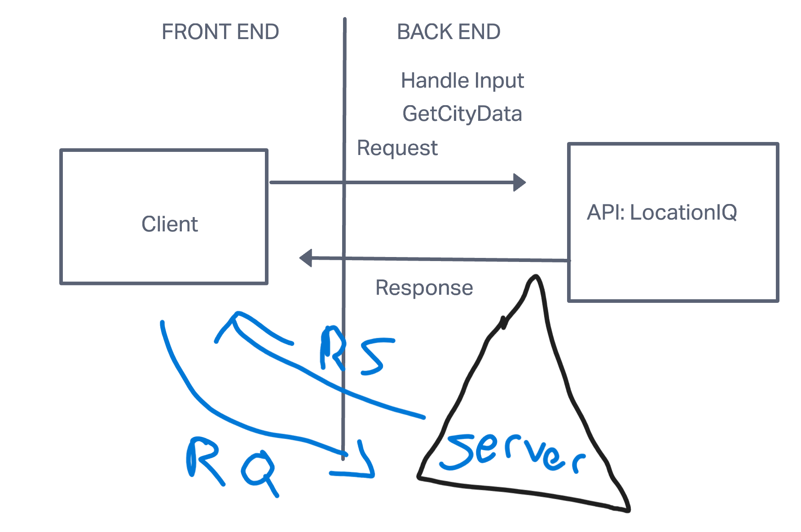

# Project Name

**Author**: Jacob Dang
**Version**: 1.0.0

## Overview
<!-- Provide a high level overview of what this application is and why you are building it, beyond the fact that it's an assignment for this class. (i.e. What's your problem domain?) -->
In this assignment I had to implement and manange both the front-end and back end of an app.

## Getting Started
<!-- What are the steps that a user must take in order to build this app on their own machine and get it running? --> 
Getting my server started is vital in order to progress with this assignment.

## Architecture
<!-- Provide a detailed description of the application design. What technologies (languages, libraries, etc) you're using, and any other relevant design information. --> 
Using node_modules, and a data file called "weather.json", along with packages such as axios, cors, and dotenv were crucial in building this back-end server.

## Change Log
<!-- Use this area to document the iterative changes made to your application as each feature is successfully implemented. Use time stamps. Here's an example:

01-01-2001 4:59pm - Application now has a fully-functional express server, with a GET route for the location resource. -->
08/23/2022 7:35pm - Application has both ends functioning and responsive to user input

## Credit and Collaborations
<!-- Give credit (and a link) to other people or resources that helped you build this application. -->
Credit goes to the TAs and the instructor for giving thorough instructions, examples, and guidance to the lab today.

Name of feature: Lab 7: Server.Js Applications

Estimate of time needed to complete: 2 hours

Start time: 2pm

Finish time: 5pm

Actual time needed to complete: 3 hours

